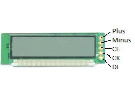

UC121902-TNARX-A
================

A Library to control the Samsumg UC121902-TNARX-A LCD module with the Arduino. You can buy it from [Pollin](http://www.pollin.de/shop/dt/MzE0OTc4OTk-/Bauelemente_Bauteile/Aktive_Bauelemente/Displays/LCD_Modul_SAMSUNG_UC121902_TNARX_A.html).

Installation
------------

See [http://www.arduino.cc/en/Guide/Libraries](http://www.arduino.cc/en/Guide/Libraries) chapter "Manual installation" for installation instructions.

Connect to Arduino
------------------

CE, CK and DI are connected to pins on the Arduino. Default values are CE=2, CK=3, DI=4.
Multiple displays can be connected. They can share CK and DI but CE should be on a different pin. 

Hello World
-----------

    #include "UC121902-TNARX-A.h"
    
    UC121902_TNARX_A::Display display(2, 3, 4);
    
    void setup() {
      display.begin();
      display.print("Hello :)");
      delay(1000);
    }
    
    int count = 0;
    
    void loop() {
      delay(1000);
      display.print("count:", count);
      count++;
    }

How to Use The Library
----------------------

### Import

One of the first lines in your Program is this:

    #include "UC121902-TNARX-A.h"

### Initialization

    UC121902_TNARX_A::Display display(CE, CK, DI);
    UC121902_TNARX_A::Display display(); // CE == 2, CK == 3, DI == 4

You can choose one of the lines. You can rename `display` to use multiple displays.

### Printing

    display.print("String");
	display.print(1234567890L);
    display.print("variable:", variable);
    display.print(character, position);

Unknown characters are replaced by '?'.
You can also use `put` and `flush`:

    display.put("String");
	display.put(1234567890L);
    display.put(character, position);
    display.flush();

`put` does not send commands to the display. `flush` sends the current state to the display.

### Symbols

These Symbols are present on the display:

    display.chan
    display.mem
    display.prog
    display.sec
    display.bell
    display.battery

They have these methods:

    display.chan.turnOn();
    display.chan.turnOff();
    display.chan.isOn();
    display.chan.isOff();
    display.chan.toggle(); 

    display.mem.turnOn();
    display.mem.turnOff();
    display.mem.isOn();
    display.mem.isOff();
    display.mem.toggle(); 

    display.prog.turnOn();
    display.prog.turnOff();
    display.prog.isOn();
    display.prog.isOff();
    display.prog.toggle(); 

    display.sec.turnOn();
    display.sec.turnOff();
    display.sec.isOn();
    display.sec.isOff();
    display.sec.toggle(); 

    display.bell.turnOn();
    display.bell.turnOff();
    display.bell.isOn();
    display.bell.isOff();
    display.bell.toggle(); 
    display.bell.mute();
    display.bell.unmute();
    display.bell.isMuted();
    display.bell.isUnmuted();
    display.bell.toggleMuted(); 

    display.battery.empty();
    display.battery.isEmpty();
    display.battery.full();
    display.battery.isFull();
    display.battery.halfFull(); 
    display.battery.isHalfFull(); 
    display.battery.turnOn();
    display.battery.turnOff();
    display.battery.isOn();
    display.battery.isOff();
    display.battery.toggle(); 

License
-------

MIT License, see the License file. Subfolders (Pollin) may have different licenses.

Related Work
------------

- [Library by Alex](https://www.mikrocontroller.net/topic/318926#3889778)
- [steppi](http://stepp-ke.de/tag/uc121902-tnarx-a/)
